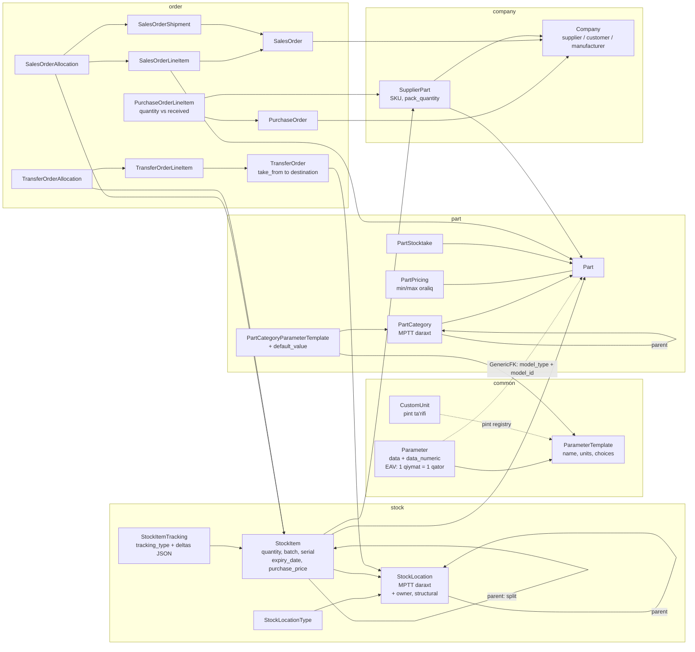

# InvenTree tahlili — dizayn qarorlarini ajratib olish

**Manba:** `InvenTree-master/` — InvenTree **1.6.0 dev** (`src/backend/InvenTree/InvenTree/version.py:18`), MIT litsenziya (`LICENSE`).

> **Atribut haqida ogohlantirish.** Manba papka git repozitoriysi emas — bu `master` branchining zip-arxivi, `.git` katalogi yo'q. Shu sababli prompt talab qilgan **commit hash mavjud emas**. Hisobotdagi barcha havolalar `fayl:qator` ko'rinishida, versiya `1.6.0 dev` deb qayd etilgan. Bosqich 2 da `NOTICE` fayli uchun aniq commit kerak bo'lsa, upstream repodan `git clone` qilib, aynan shu versiyaga mos commitni fiksatsiya qilish kerak — **buni siz hal qilishingiz kerak bo'lgan ochiq savol sifatida belgilayman.**

**Metodologiya:** har bir `models.py` dan klass va `ForeignKey` bog'lanishlari mashinaviy ajratib olindi; keyin promptda ko'rsatilgan olti yo'nalish bo'yicha maqsadli o'qish qilindi. Katta fayllar to'liq o'qilmadi.

Quyidagi barcha fayl yo'llari `InvenTree-master/src/backend/InvenTree/` ga nisbatan.

---

## 1. Ilovalar bo'yicha baho

| Ilova | Baho | Sabab |
|---|---|---|
| `part` | **MOSLASHTIRAMIZ** | Kategoriya daraxti va parametr shablonlari g'oyasi kerak, lekin MPTT → `ltree`, EAV → JSONB, BOM/variant/test qismi tashlanadi. |
| `stock` | **MOSLASHTIRAMIZ** | Harakat jurnali va split/merge/lock mantiqi qimmatli, lekin `StockItem.quantity` mutable ustuni sizning 3-qaroringizga zid. |
| `order` | **MOSLASHTIRAMIZ** | `quantity` vs `received` farqi va status mashinasi olinadi; `TransferOrder` esa sizning 6-bandingizni **qanoatlantirmaydi** (6-bo'limga qarang). |
| `company` | **MOSLASHTIRAMIZ** | `SupplierPart.pack_quantity` (o'ram miqdori) — qurilish uchun eng kerakli qism; qolgan supplier/manufacturer ierarxiyasi ortiqcha. |
| `build` | **TASHLAYMIZ** | BOM va ishlab chiqarish buyurtmalari — sizga kerak emas. |
| `common` | **MOSLASHTIRAMIZ** | `CustomUnit` va `ParameterTemplate` olinadi; `InvenTreeSetting` global (single-tenant) sozlamalar tizimi tashlanadi. |
| `plugin` | **TASHLAYMIZ** | Ortiqcha murakkablik; qolaversa validatsiya va barcode nuqtalari registry'ga qattiq bog'langan, buni yechish kerak bo'ladi. |
| `report` | **OLAMIZ** (g'oyasi) | `model_type` + `filters` + `revision` + tipli kontekst — chek va narx yorlig'i uchun to'g'ridan-to'g'ri mos arxitektura. |
| `label` | — | **Alohida ilova sifatida mavjud emas.** `LabelTemplate` `report/models.py:704` da, `ReportTemplate` bilan bir asosda. Promptdagi "label ilovasi" farazi noto'g'ri. |
| `users` | **TASHLAYMIZ** | `RuleSet` Django `Group` ustiga qurilgan, model tipi darajasida ishlaydi; obyekt darajasidagi ruxsat yo'q. |
| `machine`, `importer`, `data_exporter`, `scim`, `web` | **TASHLAYMIZ** | Printer drayverlari, CSV import sessiyalari, SCIM provisioning — MVP doirasidan tashqarida. |

### Ilovalar nima qiladi

**`part`** — mahsulot katalogi. `PartCategory` (MPTT daraxti) → `Part` (nomenklatura birligi) → `PartPricing` (narx oralig'i keshi). Bundan tashqari BOM (`BomItem`), variant/revision zanjiri (`Part.variant_of`, `Part.revision_of`), test shablonlari va inventarizatsiya tarixi (`PartStocktake`) shu yerda joylashgan.

**`stock`** — fizik qoldiq. `StockLocation` (MPTT daraxti) → `StockItem` (aniq joydagi aniq partiya) → `StockItemTracking` (harakatlar jurnali). `StockItem` ning o'zi ham daraxt (`parent` maydoni) — bo'lingan partiyalar ota-bola bog'lanishini saqlaydi.

**`order`** — barcha hujjat oqimlari: `PurchaseOrder` (kirim), `SalesOrder` (chiqim, `SalesOrderShipment` bilan), `ReturnOrder` (qaytarish), `TransferOrder` (omborlararo). Hammasi umumiy `Order` bazasidan meros oladi, ya'ni status mashinasi, `reference` shabloni va mas'ul shaxs bir joyda ta'riflangan.

**`company`** — kontragentlar. Bitta `Company` modeli bir vaqtda yetkazib beruvchi, mijoz va ishlab chiqaruvchi bo'la oladi (`is_supplier`/`is_customer` bayroqlari). `SupplierPart` — "shu yetkazib beruvchi shu mahsulotni qanday o'ram va SKU bilan sotadi" bog'lanishi.

**`build`** — ishlab chiqarish buyurtmalari. BOM bo'yicha komponentlarni ajratadi (`BuildLine`/`BuildItem`), chiqim sifatida yangi `StockItem` yaratadi.

**`common`** — ilovalararo umumiy infratuzilma: sozlamalar, bildirishnomalar, biriktirmalar, webhook. **Eng muhimi** shu yerda: `CustomUnit` (`common/models.py:1796`) hamda `ParameterTemplate`/`Parameter` (`common/models.py:2589`, `:2810`). Diqqat — 1.6.0 da parametrlar `part` dan `common` ga ko'chirilgan, lekin jadval nomlari eskiligicha qolgan (`db_table = 'part_partparametertemplate'`).

**`plugin`** — plugin registry va sozlamalari. Barcode generatsiyasi, qiymat validatsiyasi va hisobot chiqarish shu registry orqali o'tadi, ya'ni yadro kodi plugin tizimiga qattiq bog'langan.

**`report`** — Django template asosidagi hisobot va yorliq tizimi. `ReportTemplate` (ko'p sahifali PDF) va `LabelTemplate` (mm da o'lchamli yorliq) bir `ReportTemplateBase` dan meros oladi.

---

## 2. Asosiy modellar diagrammasi



---

## 3. `StockLocation` daraxti sizning 4-bandingizga mos keladimi?

**Talab 4:** foydalanuvchi faqat o'ziga ochilgan omborlarni ko'radi; bu API'ning har bir endpointida amal qilishi shart.

### Ular nima qilgan

`StockLocation` da `owner` maydoni bor (`stock/models.py:189`), u `users.Owner` ga ishora qiladi — `Owner` esa `User` yoki `Group` ni bir xil ko'rsata oladigan generik o'rovchi (`users/models.py:292`). Ruxsat tekshiruvi `StockLocation.check_ownership()` (`stock/models.py:270`) va `StockItem.check_ownership()` (`stock/models.py:1400`) da yozilgan:

- superuser hamma narsani "egallaydi";
- `STOCK_OWNERSHIP_CONTROL` global sozlamasi o'chiq bo'lsa — hammaga ruxsat;
- egasi belgilanmagan bo'lsa — hammaga ruxsat;
- aks holda `owner.is_user_allowed(user, include_group=True)` (`users/models.py:451`).

Daraxt bo'ylab meros ham bor: `get_location_owner()` ota-lokatsiyalar bo'ylab yuqoriga chiqib, birinchi topilgan egani qaytaradi (`stock/models.py:258`).

### Nimasi yetishmaydi — va bu jiddiy

**1. Bu kod umuman ishlatilmaydi.** `check_ownership` butun kod bazasida faqat testlardan chaqiriladi: `stock/test_views.py` ning 40, 43, 73, 74, 95, 96, 113, 116-qatorlari. `stock/api.py` da `owner` so'zi **umuman uchramaydi**. Ya'ni 1.6.0-dev holatida ombor egaligi API so'rovlarini filtrlamaydi — bu amalda o'lik kod. Sizning talabingiz ("frontendda yashirish yetarli emas") aynan shu nuqtada InvenTree'dan **hech narsa olmaydi**.

**2. Model bo'yicha ham yetarli emas.** `owner` — bitta `Owner` ga ishora qiluvchi `ForeignKey`, ya'ni **bir lokatsiyaning bitta egasi**. Sizga kerak bo'lgan "bir odam A omborda omborchi, B omborda ko'ruvchi" stsenariysi bu model bilan ifodalanmaydi: u `user × warehouse × permission_level` ko'p-ko'pga jadvalini talab qiladi, InvenTree'da esa `warehouse → owner` bir-ko'pga.

**3. Ruxsat darajasi yo'q.** `check_ownership` faqat boolean qaytaradi — "egasimi yoki yo'q". `ko'ruvchi` / `omborchi` / `boshqaruvchi` gradatsiyasi yo'q. Gradatsiya faqat `users.RuleSet` da bor (`can_view`/`can_add`/`can_change`/`can_delete`, `users/models.py:209`), u esa Django `Group` ga bog'langan va **model tipi** darajasida ishlaydi, obyekt darajasida emas.

**4. Filtrlash arxitekturasi mos emas.** Ular ruxsatni obyekt ustida imperativ tekshirmoqchi bo'lgan (`if item.check_ownership(user)`). Sizga esa **queryset darajasidagi filtr** kerak, aks holda ro'yxat endpointlari, agregatsiyalar va hisobotlar begona omborlar ma'lumotini sizdirib qo'yadi. Sizning RLS qaroringiz (1-qaror) bu masalani `tenant_id` uchun hal qiladi, lekin **ombor darajasidagi ko'rish huquqi RLS bilan avtomatik hal bo'lmaydi** — RLS tenantni ajratadi, tenant ichidagi omborni emas.

### Xulosa va tavsiya

> InvenTree'ning `StockLocation.owner` yechimi sizning 4-bandingizni **qo'llab-quvvatlamaydi**. Uni nusxa olishning ma'nosi yo'q — na modeli, na tatbiq mexanizmi mos.

Olinadigan yagona foydali g'oya — **egalikning daraxt bo'ylab merosi**: bola lokatsiyada ruxsat belgilanmagan bo'lsa, otadan olinadi. Bu sizning 7-bandingiz (ombor ichidagi lokatsiyalar) bilan yaxshi birlashadi: `warehouse_access` **ombor** darajasida yoziladi, ombor ichidagi javon/yacheykalar esa avtomatik shu ruxsatni meros oladi va alohida ruxsat jadvali talab qilmaydi.

Tavsiya etiladigan yo'nalish (Bosqich 2 da batafsillashtiraman): `warehouse_access` ni ikkinchi RLS policy sifatida emas, **DRF darajasidagi majburiy queryset mixin** sifatida qilish — har bir ViewSet `get_queryset()` da `user_visible_warehouses(request.user)` bo'yicha filtrlanadi, va bu mixin'siz ViewSet ro'yxatdan o'tmaydigan qilib test bilan qotiriladi. InvenTree'ning xatosi aynan shu majburiylikning yo'qligi edi: mexanizm yozilgan, lekin uni chaqirishni hech narsa majburlamagan.

---

## 4. Promptda ko'rsatilgan olti yo'nalish bo'yicha topilmalar

### 4.1. O'lchov birligi va konversiya — eng qimmatli qism, **olamiz**

**Fayllar:** `InvenTree/conversion.py` (331 qator), `common/models.py:1796` (`CustomUnit`), `InvenTree/validators.py`.

Ular qanday qilgan:

- Bitta global `pint.UnitRegistry` yaratiladi va modul darajasida keshlanadi (`reload_unit_registry()`, `conversion.py:97`).
- Registrga "standart" qo'shimchalar qo'shiladi: `piece = 1`, `each = 1 = ea`, `dozen = 12 = dz`, `hundred = 100`, `thousand = 1000` (`conversion.py:113-117`). Bu **o'lchovsiz sanoq birliklari** — sizga `qop`, `palet`, `rulon` aynan shu naqsh bo'yicha qo'shiladi.
- Foydalanuvchi bazadan yangi birlik qo'sha oladi: `CustomUnit.fmt_string()` `"dog_year = 52 * day = dy"` ko'rinishidagi pint sintaksisini yig'adi (`common/models.py:1812`), `clean()` esa uni saqlashdan oldin `registry.define()` bilan sinab ko'radi (`common/models.py:1830`).
- **Kesh invalidatsiyasi:** barcha custom birliklardan MD5 hash hisoblanadi va global sozlamada saqlanadi; boshqa process hashning o'zgarganini ko'rsa registrni qayta yuklaydi (`conversion.py:44-95`). `post_save`/`post_delete` signali ham majburiy qayta yuklaydi (`common/models.py:1881`).
- `convert_physical_value()` (`conversion.py:212`) bir necha "urinish" ni ketma-ket sinaydi: xom qiymat → muhandislik notatsiyasi (`1K2` → `1.2K`) → birlik qo'shilgan variant. Birinchi muvaffaqiyatlisi olinadi, hech biri ishlamasa `ValidationError`.
- Imperial o'lchovlar uchun kichik hiyla: `6'` → `6 feet`, `6"` → `6 inches` (`conversion.py:252-256`).

**Sizga qanday moslashtiriladi — va bitta jiddiy muammo:**

`convert_physical_value()` oxirida qiymat **`float` ga aylantiriladi** (`conversion.py:307`):

```python
magnitude = float(ureg.Quantity(magnitude).to_base_units().magnitude)
```

Bu sizning 6-qaroringizga ("`float` hech qayerda yo'q") to'g'ridan-to'g'ri zid. `pint` `Decimal` bilan ishlay oladi (`pint.UnitRegistry(non_int_type=decimal.Decimal)`), lekin u holda ba'zi amallar sekinlashadi. Bu Bosqich 2 da hal qilinishi kerak — men `Decimal` variantini tavsiya qilaman, chunki qurilishda `2.5 m³ × 1 250 000 UZS` kabi hisoblar to'g'ridan-to'g'ri pulga aylanadi.

Qurilish uchun kerakli ta'riflar (Bosqich 3 da seed sifatida):

```
dona = 1 = ea
qop = 1
palet = 1
rulon = 1
m2 = meter ** 2
m3 = meter ** 3
pogonmetr = meter = pm
```

> **Ochiq savol (kod yozishdan oldin javob kerak):** "1 qop sement = 50 kg" — bu konversiya **mahsulotga bog'liq**, global emas. Sement 50 kg, gips 30 kg, quruq aralashma 25 kg. Global `pint` registrida `qop = 50 * kg` deb yozib bo'lmaydi. InvenTree buni `SupplierPart.pack_quantity` orqali hal qiladi — o'ram miqdori mahsulot-yetkazib beruvchi juftligida saqlanadi, registrda emas. Siz `qop → kg` ni (a) variant maydonida, (b) atribut sifatida JSONB da, yoki (c) alohida `product_units` jadvalida saqlamoqchimisiz? Bu qaror ombor modelining shakliga jiddiy ta'sir qiladi.

### 4.2. Parametr shablonlari — g'oyasi olinadi, saqlash butunlay qayta loyihalanadi

**Fayllar:** `common/models.py:2589` (`ParameterTemplate`), `:2810` (`Parameter`), `part/models.py:352` (`PartCategoryParameterTemplate`), `part/models.py:2349` (`copy_category_parameters`).

Ular qanday qilgan:

- `ParameterTemplate` — atribut ta'rifi: `name`, `units`, `checkbox`, `choices` (vergul bilan ajratilgan matn), `selectionlist` (FK), `enabled`, `unique`.
- `PartCategoryParameterTemplate` — shablonni kategoriyaga bog'laydi va **shu kategoriya kontekstidagi `default_value`** ni saqlaydi, `UniqueConstraint(['category','template'])` bilan.
- **Meros:** `Part.copy_category_parameters()` mahsulot yaratilganda `category.get_ancestors(include_self=True)` bo'ylab barcha shablonlarni yig'adi, `order_by('-category__level')` bilan **eng chuqur kategoriya ustun** bo'ladi, va har bir shablon uchun `Parameter` qatori yaratadi (`part/models.py:2349-2395`).
- `Parameter` — EAV qatori: `model_type` + `model_id` (GenericFK) + `template` + `data` (matn) + **`data_numeric` (float)**.
- Shablon o'zgarganda barcha bog'liq parametrlar fonda qayta hisoblanadi (`post_save_parameter_template` → `common.tasks.rebuild_parameters`, `common/models.py:2782`).

**Uch qimmatli g'oya — saqlash usulidan mustaqil, JSONB ga to'liq ko'chadi:**

1. **Ikki tomonlama saqlash: xom matn + normalizatsiyalangan son.** `data` foydalanuvchi kiritgan holicha (`"12 mm"`), `data_numeric` esa bazaviy SI birlikka keltirilgan son (`calculate_numeric_value()`, `common/models.py:2917`). Qidiruv va taqqoslash `data_numeric` bo'yicha, ko'rsatish `data` bo'yicha ketadi. **Bu naqshni JSONB da ham saqlash shart** — masalan `{"qalinlik": {"raw": "12 mm", "num": 0.012}}`. Aks holda "10 mm" va "1 sm" turli qiymat bo'lib qoladi va filtrlash ishlamaydi. GIN indeksi ham `num` kaliti bo'yicha qurilishi kerak.
2. **Unikallik normalizatsiyalangan qiymat bo'yicha.** `validate_uniqueness()` (`common/models.py:2949`) birlik berilgan bo'lsa `data_numeric` bo'yicha, aks holda `data__iexact` bo'yicha tekshiradi — ya'ni `1k` va `1000` dublikat deb topiladi.
3. **Kategoriya default'i — bir martalik nusxa, jonli meros emas.** Bu **ongli qaror**: mahsulot yaratilganda qiymatlar ko'chiriladi, keyin kategoriya shabloni o'zgarsa mavjud mahsulotlar o'zgarmaydi. Afzalligi — o'qish arzon va bashorat qilinadigan; kamchiligi — kategoriyaga yangi atribut qo'shsangiz eski mahsulotlarda u paydo bo'lmaydi.

Yana bitta e'tiborga loyiq detal: `unique` shartli shablonlar kategoriya default'idan **ataylab chetlab o'tiladi** (`part/models.py:2379`) — bir xil default qiymatni butun kategoriyaga qo'yish unikallik shartini darhol buzardi. Kichik, lekin oldindan o'ylanmasa migratsiyada xato tug'diradigan joy.

> **Ochiq savol:** siz qaysi semantikani xohlaysiz — nusxa (InvenTree yo'li) yoki jonli meros? JSONB bilan jonli meros ancha oson bo'ladi (o'qishda `attribute_definitions` ni kategoriya ajdodlari bo'ylab yig'ib, variant JSONB'i bilan ustma-ust qo'yiladi), lekin har o'qishda qo'shimcha yuk beradi. Bu `attribute_definitions` jadvalining shakliga ta'sir qiladi, shuning uchun Bosqich 3 dan oldin javob kerak.

### 4.3. Qoldiq tarixi — arxitekturasi sizga zid, lekin ichidagi mantiq oltin

**Fayllar:** `stock/models.py:426` (`StockItem`), `:3716` (`StockItemTracking`), `stock/status_codes.py:44` (`StockHistoryCode`).

**Tub farq:** InvenTree'da qoldiq — bu `StockItem.quantity` **mutable ustuni** (`stock/models.py:1247`). `StockItemTracking` esa faqat audit jurnali: uni butunlay o'chirsangiz qoldiq o'zgarmaydi. Sizning 3-qaroringiz teskari: jurnal — haqiqat manbai, qoldiq — hosila. **Ya'ni `StockItem` ni nusxa olib bo'lmaydi.** Lekin uning atrofidagi mantiq qimmatli:

**`lock_quantity()` (`stock/models.py:3149`) — poyga holatidan himoya.** `SELECT ... FOR UPDATE` bilan qatorni qulflaydi va `quantity` ni bazadan qayta o'qiydi, shundan keyingina o'zgartirish qilinadi. Har bir muhim operatsiya (`splitStock`, `complete_allocation`, `take_stock`) shu bilan boshlanadi. **Sizga ham kerak** — append-only jurnalda ham `stock_balances` keshini yangilashda aynan shu muammo turadi.

**`deltas` JSON maydoni (`stock/models.py:3796`).** Har bir jurnal yozuvi o'zgarish tafsilotini erkin JSON sifatida saqlaydi: `{'stockitem': 42, 'quantity': 10.0, 'location': 7, 'status': 50}`. Bu sxemani o'zgartirmasdan yangi harakat turlarini qo'shishga imkon beradi. **Diqqat:** `add_tracking_entry()` da `deltas['quantity'] = float(quantity)` (`stock/models.py:2373`) — yana `float`. Sizda bu `str(Decimal)` bo'lishi kerak, aks holda audit jurnalining o'zi yaxlitlash xatosi manbaiga aylanadi.

**Harakat turlari ro'yxati (`StockHistoryCode`).** 25 dan ortiq kod: `CREATED`, `STOCK_COUNT`, `STOCK_ADD`, `STOCK_REMOVE`, `STOCK_MOVE`, `SPLIT_FROM_PARENT`, `SPLIT_CHILD_ITEM`, `MERGED_STOCK_ITEMS`, `RECEIVED_AGAINST_PURCHASE_ORDER`, `SHIPPED_AGAINST_SALES_ORDER`, `RETURNED_FROM_CUSTOMER` va boshqalar. **Bu ro'yxatning o'zi qimmatli** — sizning `stock_movements.reason` enum'i uchun tayyor asos. Diqqat qiling: ular har bir harakat uchun **ikki tomonlama** kod ajratgan (`SPLIT_FROM_PARENT` va `SPLIT_CHILD_ITEM`), ya'ni bir amalning ikki tomoni alohida yoziladi.

**`splitStock()` (`stock/models.py:2846`) — partiyani bo'lish.** Yangi `StockItem` yaratiladi, `parent` orqali eskisiga bog'lanadi, ikkala tomonga jurnal yozuvi tushadi. Diqqatga sazovor himoyalar: seriyalangan tovarni bo'lib bo'lmaydi, to'liq miqdorni bo'lib bo'lmaydi (`quantity >= self.quantity` → `None`), nol yoki manfiy miqdor rad etiladi, ishlab chiqarishdagi tovar bo'linmaydi.

**`can_merge()` / `find_merge_target()` (`stock/models.py:2614`, `:2674`) — birlashtirish.** Birlashtirish uchun sakkizta shart tekshiriladi: buyurtmaga ajratilgan emas, mijozga biriktirilgan emas, ichida boshqa tovar yo'q, boshqa tovar ichida emas, ishlab chiqarishda emas, seriyalangan emas, bir xil mahsulot, bir xil status. `find_merge_target()` esa **avval bir xil partiya kodli** nomzodni qidiradi, keyin qolganlarini. Sizda `stock_balances` keshi bo'lgani uchun "birlashtirish" tushunchasi boshqacha ko'rinadi, lekin **partiya va status bo'yicha qoldiqni ajratib turish zarurati** aynan shu ro'yxatdan ko'rinadi.

### 4.4. Shtrix-kod — g'oyasi olinadi, modeli yetarli emas

**Fayl:** `InvenTree/models.py:1495` (`InvenTreeBarcodeMixin`).

Ular ikki xil kodni ajratadi:

- **Ichki kod** — qat'iy formatdagi QR, model tipi kodi va `pk` asosida generatsiya qilinadi. Har model ikki belgilik kod beradi (`StockLocation` → `SL`, `stock/models.py:172`). 45² = 2025 ta kombinatsiya bo'lgani uchun to'qnashuvdan saqlanish maqsadida har model o'z kodini qo'lda belgilaydi (`barcode_model_type_code()` abstrakt, e'lon qilinmasa `NotImplementedError`).
- **Tashqi kod** — uchinchi tomon shtrix-kodini obyektga biriktirish: `barcode_data` (xom qiymat) + `barcode_hash` (indekslangan hash). Qidiruv `lookup_barcode(barcode_hash)` orqali hash ustuni bo'yicha ketadi (`InvenTree/models.py:1596`).

**Sizga yetarli emas:** `barcode_data`/`barcode_hash` — modeldagi **oddiy ustunlar**, ya'ni **bir obyektga bitta tashqi kod**. Sizning talabingiz "bir mahsulotga bir nechta kod biriktirish". Bu alohida `barcodes (tenant_id, code, code_type, variant_id)` jadvalini talab qiladi, `UNIQUE (tenant_id, code)` bilan.

Olinadigan g'oya — **xom qiymatni ham, normalizatsiyalangan qidiruv kalitini ham saqlash** (bo'shliq, registr, yetakchi nol va prefiks farqlari uchun), va kod turini (EAN-13, Code128, ichki QR) alohida ustunda belgilash. Yana: `common/models.py:3414` da `BarcodeScanResult` bor — skanerlash urinishlari jurnali (kim, qachon, qanday kod, topildimi). Do'kon sharoitida "skaner ishlamayapti" shikoyatlarini tekshirish uchun juda foydali, arzon qo'shimcha.

### 4.5. Narx hisobi — eng katta bo'shliq: FIFO ham, o'rtacha narx ham **YO'Q**

**Fayl:** `part/models.py:2606` (`PartPricing`).

Butun kod bazasi bo'ylab `FIFO`, `weighted_average`, `moving_average`, `COGS` qidiruvi **bitta ham natija bermadi** (`stock/models.py:416` dagi UI saralash yorlig'idan tashqari — u shunchaki "eski tovar avval" degan saralash tartibi).

`PartPricing` ning barcha maydonlari **min/max juftliklari**: `bom_cost_min/max`, `purchase_cost_min/max`, `internal_cost_min/max`, `supplier_price_min/max`, `variant_cost_min/max`, `override_min/max`, `overall_min/max`, `sale_price_min/max`, `sale_history_min/max`.

Ya'ni InvenTree **tannarxni hisoblamaydi** — u "bu mahsulot taxminan qanchaga tushadi" degan **oraliqni** ko'rsatadi, asosan BOM kalkulyatsiyasi uchun. `update_purchase_cost()` (`part/models.py:2960`) yakunlangan kirim hujjatlari bo'ylab yurib faqat eng arzon va eng qimmat narxni topadi, o'rtachani emas.

> **Bu sizning eng katta qopqog'ingiz.** Chakana va ulgurji savdoda sotilgan tovarning tannarxi (COGS) — foyda hisobotining asosi, ixtiyoriy qo'shimcha emas. Bu qismni InvenTree'dan **umuman ola olmaysiz**, noldan loyihalash kerak.

Olinadigan ikkita mayda g'oya:

- **`purchase_price` `StockItem` darajasida saqlanadi** (`stock/models.py:1342`) — ya'ni har partiya o'z kirim narxini eslab qoladi. Sizning append-only jurnalingizda bu tabiiy joylashadi: har `stock_movements` kirim yozuvi o'z `unit_cost` va `currency` sini olib yuradi, FIFO shundan hisoblanadi.
- **`pack_quantity_native`** (`company/models.py:672` atrofida) — yetkazib beruvchi narxi o'ramga, qoldiq esa bazaviy birlikka bog'langanda, narx `pack_quantity_native` ga bo'linadi (`part/models.py:2985`). Qurilishda bu doimiy holat: sement qopda keladi, kubometrda yoki tonnada sotiladi.

**Valyuta:** `django-money` va `djmoney.contrib.exchange` ishlatiladi (`InvenTree/exchange.py:15`). Kurslar `Rate` jadvalida saqlanadi, lekin u **joriy kursni** ushlaydi — har yangilanishda ustiga yoziladi, tarix qolmaydi. Sizning "kurs tarixi" talabingiz uchun bu yetarli emas; `exchange_rates (currency, rate, valid_from)` ni o'zingiz qilishingiz kerak.

`convert()` metodidagi bitta yaxshi detal (`part/models.py:2654`): kurs topilmasa `MissingRate` tutiladi, ogohlantirish yoziladi va `None` qaytariladi — bitta valyuta kursi yo'qligi butun narx hisobini yiqitmaydi.

### 4.6. Hisobot va yorliq shablonlari — arxitekturasi olinadi

**Fayl:** `report/models.py:195` (`ReportTemplateBase`), `:362` (`ReportTemplate`), `:704` (`LabelTemplate`).

Ikkalasi bitta asosdan meros oladi. Muhim maydonlar: `name`, `template` (FileField — Django template fayli), `model_type` (matn sifatida — qaysi modelga tegishli), `filters` (matn sifatida saqlangan queryset filtri — shablon qaysi obyektlarga taklif qilinishini cheklaydi), `filename_pattern`, `revision` (avtomatik oshadi), `enabled`, `attach_to_model`.

`LabelTemplate` qo'shimcha `width`/`height` (mm da) beradi va ularni CSS `@page { size: {width}mm {height}mm }` ga o'giradi (`report/models.py:745` atrofida) — ya'ni yorliq printerga PDF sahifa o'lchami orqali moslashadi.

Har model o'z **kontekstini** `report_context()` metodida `TypedDict` sifatida e'lon qiladi — masalan `StockLocationReportContext` (`stock/models.py:108`), `PartReportContext` (`part/models.py:432`). Bu shablon mualliflari uchun hujjatlangan, tipli interfeys demak: shablonda qaysi o'zgaruvchilar borligi kodda ko'rinib turadi.

**Bu naqsh juda yaxshi va arzon** — narx yorlig'i va chek uchun to'g'ridan-to'g'ri ko'chiriladi. Yagona moslashtirish: `revision` va `filters` tenant kontekstida ishlashi, shablon fayllari esa tenant bo'yicha ajratilishi kerak (aks holda bir tenant ikkinchisining chek shablonini ko'radi).

Kichik izoh: `width`/`height` — `FloatField` (`report/models.py:722`, `:726`). Bu pul emas, shuning uchun 6-qaroringizni buzmaydi, lekin izchillik uchun `Decimal` qilish arzon.

---

## 5. Ular hal qilgan, sizning talablar ro'yxatingizda ko'rinmayotgan muammolar

Bu bo'lim — hisobotning eng qimmatli qismi. Quyidagilarning har biri sizning hujjatlaringizda uchramadi, lekin ombor tizimida ertami-kechmi albatta chiqadi.

### 5.1. "Bor" qoldiq ≠ "sotish mumkin" qoldiq — ajratilgan (allocated) miqdor

Sizning 3-bandingiz qoldiqni `(variant × ombor)` kesimida bitta son deb ta'riflaydi. InvenTree'da esa **uch xil son** bor va ular ataylab ajratilgan (`part/filters.py:465-482`):

```
available_stock = total_stock
                - allocated_to_sales_orders
                - allocated_to_build_orders
```

Amaliy stsenariy: omborda 100 qop sement bor, lekin 80 tasi ertaga jo'natiladigan buyurtmaga band qilingan. Sotuvchi 50 qop sotmoqchi. Tizim "100 bor" desa — bu xato va u mijoz oldida chiqadi.

`Greatest(..., Decimal(0))` bilan o'ralgan — ortiqcha ajratish bo'lganda manfiy son ko'rsatilmaydi, `is_overallocated()` esa buni alohida bayroq sifatida beradi. Ya'ni ular manfiy qoldiqni yashirmaydi, lekin uni miqdor sifatida emas, **holat** sifatida ko'rsatadi.

**Sizga ta'siri:** `stock_balances` keshida kamida ikki ustun kerak: `quantity` va `reserved_quantity`. Yoki ajratmalar alohida `stock_reservations` jadvalida yozilib, qoldiq ko'rsatilganda ayirilishi kerak. **Buni keyin qo'shish qiyin** — chunki barcha "sotish mumkinmi?" tekshiruvlari shu songa bog'lanadi va ular butun kod bo'ylab tarqaladi.

### 5.2. Yaroqlilik muddati va partiya kodi

`StockItem` da `expiry_date` (`stock/models.py:1296`) va `batch` (`:1238`) maydonlari bor. Atrofida butun mantiq: `is_stale()` — muddati yaqinlashgan (`STOCK_STALE_DAYS` sozlamasi bo'yicha), `is_expired()` — o'tib ketgan, `get_expired_filter()` — queryset darajasidagi filtr (`stock/models.py:667`).

**Qurilish materiallari uchun bu ixtiyoriy emas.** Sement 3-6 oy, quruq aralashmalar 6-12 oy, gruntovka va mastikalar muzlashdan keyin yaroqsiz. Muddati o'tgan tovarni sotib yuborish — real moliyaviy va huquqiy risk, ayniqsa ulgurji mijoz qurilish obyektiga olib ketsa.

`batch` esa partiyani ajratadi: bir xil mahsulotning ikki yetkazmasi turli narx, turli muddat va turli sifatga ega bo'ladi. Sizning append-only jurnalingizda `batch` **harakat atributi emas, qoldiq o'lchovi** bo'lishi kerak — ya'ni qoldiq aslida `(variant × ombor × partiya)` kesimida, `(variant × ombor)` esa uning agregati.

> Bu 3-bandingizga jiddiy tuzatish. Agar partiyani keyin qo'shmoqchi bo'lsangiz, butun `stock_balances` sxemasi, unique constraint'lar va FIFO mantiqi qayta yozilishi kerak bo'ladi.

### 5.3. Inventarizatsiya — hisoblangan qoldiq va sanab chiqilgan qoldiq farqi

`PartStocktake` (`part/models.py:3404`) ma'lum sanadagi qoldiqni "muzlatib" saqlaydi: `item_count`, `quantity`, `date`, `user`. `StockItem.stocktake()` (`stock/models.py:3222`) esa sanash natijasini qabul qilib, farqni `STOCK_COUNT` kodi bilan jurnalga yozadi.

**Nima uchun muhim:** append-only jurnal nazariy jihatdan har doim to'g'ri qoldiq beradi. Amalda esa omborda o'g'irlik, sinish, namlikdan buzilish, yo'qolish va oddiy inson xatosi bo'ladi. Fizik sanash bilan hisoblangan qoldiq **doim farq qiladi**, va bu farqni:

1. aniqlash,
2. sababini yozib qo'yish,
3. tuzatuvchi harakat sifatida jurnalga kiritish

kerak — aks holda jurnalning "haqiqat manbai" degan da'vosi amalda buziladi va foydalanuvchi tizimga ishonishni to'xtatadi.

Sizning `stock_movements.reason` enum'ida `INVENTARIZATSIYA_KORREKSIYA` bo'lishi shart, va u boshqa harakatlardan ajratilgan holda hisobotga chiqishi kerak — chunki bu **yo'qotish**, savdo emas. Aks holda foyda hisoboti buziladi.

### 5.4. Seriya raqami va uni saralash muammosi

`StockItem` da `serial` (matn) va **`serial_int` (butun son)** maydonlari birga turadi (`stock/models.py:1221`, `:1229`). Sabab: seriya raqamlari `"ABC-0012"` kabi matn bo'ladi, lekin ularni **tartib bo'yicha saralash va "keyingi raqam" ni topish** kerak — matn sifatida saralanganda `"10"` `"9"` dan oldin keladi. `convert_serial_to_int()` (`stock/models.py:847`) matndan sonli qismni ajratib `serial_int` ga yozadi, `get_next_serialized_item()` shu bo'yicha ishlaydi.

Bundan ham qimmatlisi — `_lock_serial_numbers()` (`stock/models.py:676`): bir vaqtda ikki foydalanuvchi seriya raqami bergan holatda dublikat chiqmasligi uchun maxsus qulflash. Bu klassik poyga holati.

**Qurilishda seriya raqami kamdan-kam kerak** (asboblar, nasoslar, kotellar, eshiklar bundan mustasno), shuning uchun buni MVP dan chiqarish mumkin. Lekin `serial_int` naqshi — **matnli identifikatorni sonli ustunga dublikatlash** — sizga hujjat raqamlari (`SF-2026-00042`) uchun aynan shu ko'rinishda kerak bo'ladi, va bir vaqtda ikki kassa chek raqami bergan holat ham xuddi shu qulflash muammosini beradi.

### 5.5. "Strukturaviy" tugunlar — daraxtga tovar joylashtirishni taqiqlash

`StockLocation.structural` bayrog'i (`stock/models.py:206`): tugunga **to'g'ridan-to'g'ri tovar joylashtirib bo'lmaydi**, faqat uning bolalariga. `clean()` esa ichida allaqachon tovar bo'lgan lokatsiyani strukturaviy qilishga yo'l qo'ymaydi (`stock/models.py:292`).

Bu kichik, lekin ma'lumot sifatini uzoq muddatda saqlaydigan detal. Sizning 7-bandingizda (ombor ichida qator/javon/yacheyka) bu to'g'ridan-to'g'ri kerak bo'ladi: "Ombor A" tugunining o'ziga tovar tushmasligi, faqat "Ombor A → 3-qator → 2-javon" ga tushishi kerak. Aks holda inventarizatsiyada bir qism tovar "omborda, lekin qayerdaligi noma'lum" holatida qoladi va bu **hech qachon tozalanmaydi** — chunki uni tozalash uchun kimdir butun omborni qayta sanashi kerak.

`external` bayrog'i ham bor (`stock/models.py:200`) — "bu tashqi lokatsiya" (mijozda, yo'lda, sub-podryadchida). Sizning "tranzit" ombor turingizga yaqin, lekin InvenTree buni **tur** emas, **bayroq** qilgan. Bayroq moslashuvchanroq: ombor bir vaqtda "savdo nuqtasi" **va** "tashqi" bo'la oladi.

### 5.6. `delete_on_deplete` — nol qoldiqli yozuvni o'chirish, va nega sizda bu muammo yo'q

`StockItem.delete_on_deplete` (`stock/models.py:1324`): miqdor nolga tushganda yozuv o'chiriladi. Bu `StockItem` mutable bo'lgani uchun zarur — aks holda baza nol qoldiqli minglab yozuv bilan to'lib ketadi va har bir qoldiq so'rovi shularni ham skanerlaydi.

**Sizda bu muammo umuman bo'lmaydi** — append-only jurnalda "nol qoldiqli yozuv" degan tushuncha yo'q, qoldiq shunchaki yig'indi.

Buni bu yerda **nima uchun sizning arxitekturangiz yaxshiroq ekanining dalili** sifatida yozib qo'yaman: `complete_allocation()` ichida upstream mualliflarining o'z izohi bor (`order/models.py:4247` atrofida):

> *"NOTE: if delete_on_deplete is enabled, this will result in the 'transferred stock' panel being empty after completion. A more sophisticated immutable tracking that doesn't rely on allocations would be helpful here"*

Ya'ni ular ham o'zgarmas (immutable) jurnalga qarab ketyapti, lekin mutable `quantity` ustuni ularni ushlab turibdi. Sizning 3-qaroringiz to'g'ri.

---

## 6. Alohida ogohlantirish: `TransferOrder` sizning 6-bandingizni bajarmaydi

Prompt `TransferOrder` ni to'g'ridan-to'g'ri so'ramagan, lekin 6-band ("omborlar orasida ko'chirish ikki bosqichli: jo'natildi → qabul qilindi") uchun bu eng yaqin nomzod, shuning uchun tekshirdim.

`TransferOrder` (`order/models.py:3668`) statuslari: `PENDING → ISSUED → COMPLETE`, yon tomonda `ON_HOLD` va `CANCELLED` (`order/status_codes.py:139`). Ko'rinishidan ikki bosqichli, lekin:

- **Tovar `COMPLETE` bo'lgungacha manba omborda turadi.** `complete_order()` (`order/models.py:3918`) barcha ajratmalarni bir yo'la bajaradi, `complete_allocation()` esa `StockItem` ni yangi lokatsiyaga **bir qadamda** ko'chiradi (`order/models.py:4205`). **"Yo'lda" (in-transit) holati yo'q** — tovar yo A omborda, yo B omborda.
- **Kamomad qayd etilmaydi.** `transfer_quantity = min(self.quantity, self.item.quantity)` — agar ajratilgandan keyin qoldiq kamaygan bo'lsa, ko'chirish **jimgina kichikroq miqdorda** bajariladi va farq hech qayerda yozilmaydi. Sizning "oradagi farq alohida ko'rinishi kerak" talabingizning to'g'ridan-to'g'ri aksi.

`TransferOrder` — bu **ko'chirishni oldindan rejalashtirish va tasdiqlash navbati**, ikki bosqichli ko'chirish emas.

Sizga kerak bo'lgan naqsh aslida boshqa joyda — `PurchaseOrderLineItem` da: `quantity` (buyurtma qilingan) va `received` (qabul qilingan) **ikki alohida ustun**, `remaining()` esa farqni beradi, `is_completed()` esa `received >= quantity` ni tekshiradi (`order/models.py:2354`, `:2415`, `:2420`). Yana bir tayyor detal: `Q(received__lt=F('quantity'))` filtri (`order/models.py:2261`) — "hali to'liq kelmagan qatorlar" ni bitta so'rov bilan topadi.

Aynan shu naqsh sizning ko'chirish hujjatingizga ko'chiriladi: `qty_sent` va `qty_received` ikki ustun, farq esa aniq ko'rinadigan kamomad. Va jurnal tomonida bu **ikki alohida harakat** bo'ladi: `TRANSFER_OUT` (jo'natishda, manba ombordan) va `TRANSFER_IN` (qabulda, maqsad omborga) — oraliqda farq "yo'lda yo'qolgan" sifatida uchinchi yozuvga tushadi.

---

## 7. Umumiy xulosa

**Haqiqatan qimmatli va olinadigan uchta narsa:**

1. `pint` integratsiyasi va `CustomUnit` — birlik registri, kesh invalidatsiyasi, ko'p urinishli parsing (`InvenTree/conversion.py`). `Decimal` ga o'tkazish sharti bilan.
2. Xom qiymat + normalizatsiyalangan son juftligi (`data` / `data_numeric`) — JSONB atributlariga to'liq ko'chiriladi.
3. Hisobot va yorliq shablon arxitekturasi — `model_type` + `filters` + `revision` + tipli kontekst.

**Foydali, lekin qayta yoziladigan:** `lock_quantity()` naqshi, `StockHistoryCode` ro'yxati, split/merge shartlari ro'yxati, `quantity` vs `received` farqi, `structural`/`external` bayroqlari, `serial_int` naqshi.

**Umuman olinmaydigan:** ruxsat tizimi (obyekt darajasida ishlamaydi), narx hisobi (FIFO va o'rtacha narx yo'q), `StockItem` mutable qoldiq modeli, `TransferOrder` (ikki bosqichli emas), butun `build` ilovasi, plugin tizimi, global sozlamalar (`InvenTreeSetting`).

**O'zimga savol — "bu InvenTree'ning yechimi menga mos, yoki men shunchaki uni takrorlayapmanmi?"**

Ikkita joyda "takrorlash" xavfi aniq ko'rindi va ikkalasidan ham voz kechishni tavsiya qilaman:

- **`StockLocation.owner` egalik modeli** — jozibador ko'rinadi ("tayyor ruxsat tizimi bor ekan"), lekin u ishlamaydi va sizning talabingizga mos ham emas.
- **`PartPricing` min/max oralig'i** — "narx hisobi bor ekan" deb o'ylab olib qo'yish oson, aslida u butunlay boshqa masalani (BOM kalkulyatsiyasi) hal qiladi va sizning COGS talabingizga hech qanday aloqasi yo'q.

---

## 8. Bosqich 2 ga o'tishdan oldin javob kerak bo'lgan savollar

1. **Birlik konversiyasi `Decimal` da bo'lsinmi?** `pint` ni `non_int_type=Decimal` bilan ishga tushirish sekinroq, lekin 6-qaroringizga mos. Tavsiyam — ha. (4.1)
2. **"1 qop = 50 kg" qayerda saqlanadi?** Variant maydonidami, JSONB atributdami, yoki alohida `product_units` jadvalidami? Global `pint` registrida bo'lishi mumkin emas, chunki konversiya mahsulotga bog'liq. (4.1)
3. **Kategoriya atributlari nusxa bo'lsinmi yoki jonli meros?** (4.2)
4. **Qoldiq `(variant × ombor × partiya)` kesimida bo'lsinmi?** Yaroqlilik muddati ham, FIFO ham partiyani talab qiladi. (5.2)
5. **`reserved_quantity` MVP ga kiradimi?** Keyin qo'shish qimmat, chunki barcha "sotish mumkinmi?" tekshiruvlariga tegadi. (5.1)
6. **Tannarx qaysi usulda — FIFO yoki o'rtacha vaznli?** InvenTree'da ikkalasi ham yo'q, noldan loyihalanadi. (4.5)
7. **MIT atributi uchun aniq commit kerakmi?** Manba zip-arxiv, `.git` yo'q. Kerak bo'lsa upstream'dan clone qilish lozim. (hisobot boshi)
